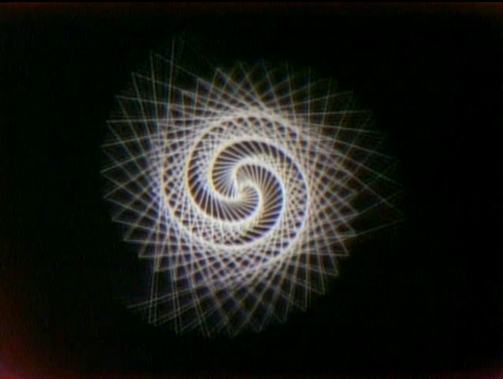
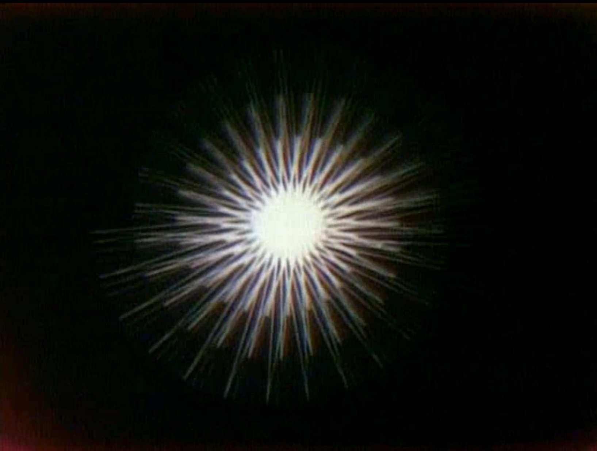
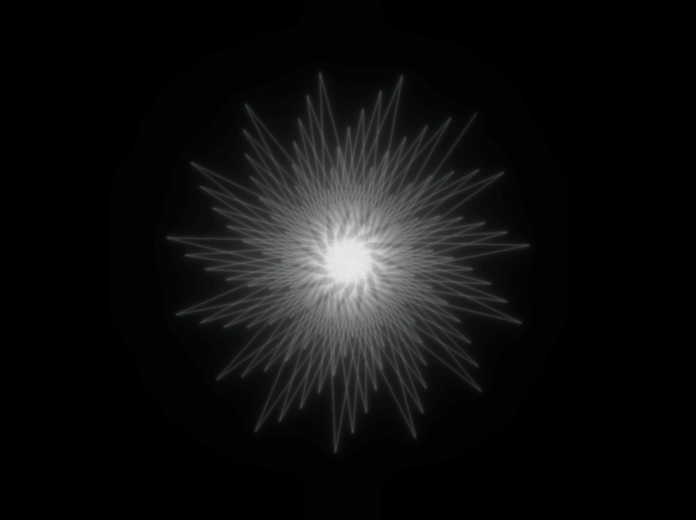
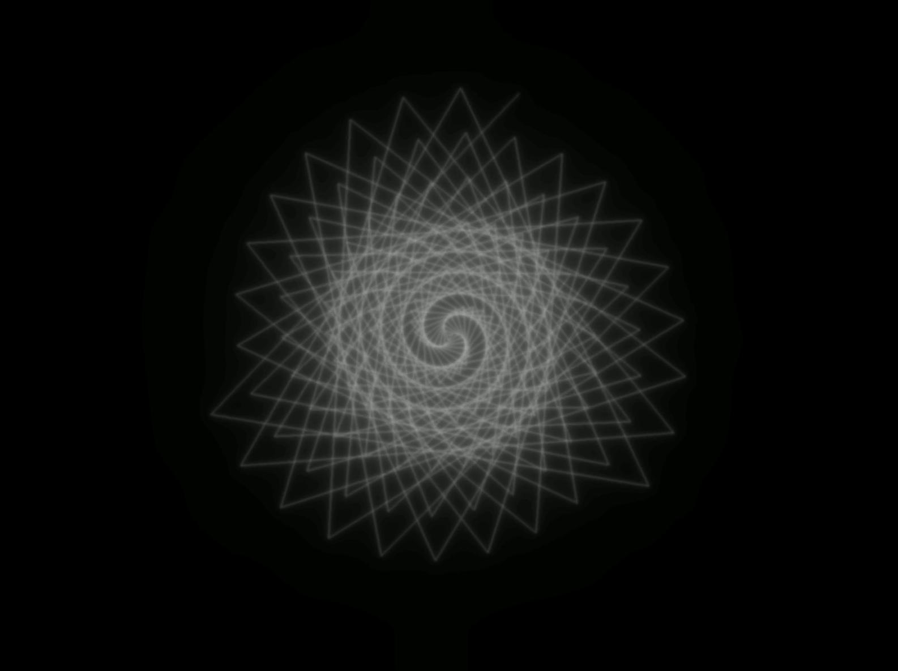

# After John Whitney Sr. - Osaka

Stills from the original film, Osaka by John Whitney Sr.

Stills from my re-creation.

Made for Zach Leiberman's Reconstructing the Past Course at SFPC. This ended up being really interesting - the puzzle of figuring out how it was done was the real work, the execution was quick. I used ofxBlur to get a nice glow. I didn’t have time to code the timing and so used a MidiFighter Twister knob to control the speed during playback - it took several tries to get it even close to right.

[Link to original Video](https://drive.google.com/file/d/1pSk-1QMUXGqnbldAHmlqiIffP1oWz6d9/view?usp=sharing) - "Osaka" by John Whintey Sr.

[Link to my Video](https://drive.google.com/file/d/1Vk0frOz3VIUViwl7hz-OvV4vt9mk5A6J/view?usp=sharing) - "Osaka after John Whintey Sr." by Chris Coleman